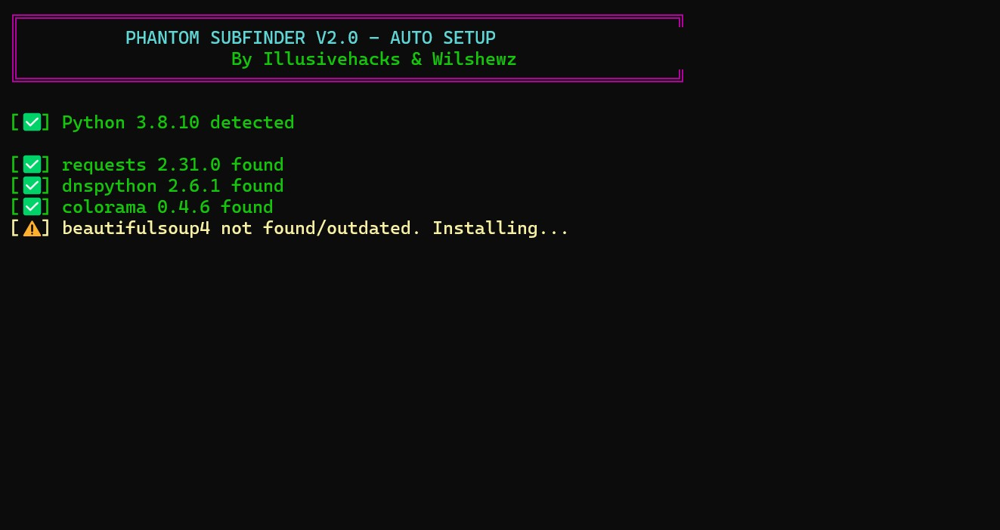
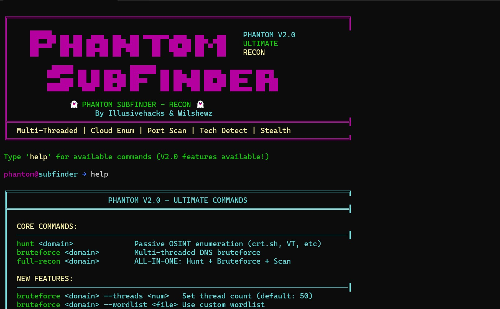

# Phantom-SubFinder
Ultimate Reconnaissance Tool | Subdomain Discovery | Network Mapping


---

## Table of Contents

1. Overview
2. Features
3. System Requirements
4. Installation
5. Usage Guide
6. Command Reference
7. Technical Architecture
8. Module Documentation
9. Output Formats
10. Screenshots
11. Troubleshooting
12. Performance Optimization
13. Security Notice
14. Disclaimer
15. License

---

## Overview

Phantom Subfinder v2.0 is a professional-grade reconnaissance tool designed for security researchers, penetration testers, and system administrators. The tool performs comprehensive subdomain enumeration through multiple OSINT sources, DNS bruteforcing, live host validation, port scanning, cloud asset discovery, technology fingerprinting, and dependency mapping.

The tool operates through an interactive terminal interface or command-line mode, featuring multi-threaded architecture for high-speed enumeration, stealth capabilities for evading detection, and extensive export options including JSON, HTML, and plain text formats.

---

## Features

### Core Enumeration Capabilities

| Feature | Description |
|---------|-------------|
| Multi-Source OSINT | Queries 9+ public sources including crt.sh, VirusTotal, AlienVault |
| DNS Bruteforce | High-speed dictionary attacks with configurable thread counts |
| Recursive Discovery | Deep enumeration of sub-subdomains with configurable depth |
| Live Host Validation | HTTP/HTTPS probing with status code and title extraction |
| Port Scanning | TCP port discovery with service banner grabbing |
| Cloud Asset Discovery | S3 bucket, Azure blob, and GCP bucket enumeration |
| Technology Fingerprinting | CMS, framework, and server detection from HTTP responses |
| Dependency Mapping | Builds relationship graphs between discovered subdomains |

### Advanced Capabilities

| Feature | Description |
|---------|-------------|
| Stealth Mode | User-Agent rotation, configurable delays, proxy support |
| Multi-Threading | Configurable thread pools for optimal performance |
| SSL Bypass | Disables certificate verification for broad scanning |
| Wordlist Management | Built-in common and heavy wordlists with custom support |
| Export Formats | JSON, HTML report, and plain text output |
| Interactive Shell | Command-line interface with tab completion support |

### OSINT Sources

| Source | Data Type |
|--------|-----------|
| crt.sh | SSL certificate subdomains |
| VirusTotal | Passive DNS records |
| ThreatCrowd | Historical subdomain data |
| HackerTarget | DNS enumeration |
| RapidDNS | Subdomain database |
| AlienVault OTX | Passive DNS |
| URLScan.io | Historical scans |
| SecurityTrails | Subdomain discovery |
| Censys | Host discovery |

---

## System Requirements

### Minimum Requirements

| Component | Requirement |
|-----------|-------------|
| Operating System | Windows 10/11, Linux (Ubuntu 20.04+), macOS 11+ |
| Processor | Dual-core 2.0 GHz |
| RAM | 2 GB |
| Disk Space | 200 MB |
| Python Version | 3.7 or higher |
| Network | Internet connection for API queries |

### Required Python Packages

| Package | Version | Purpose |
|---------|---------|---------|
| requests | 2.25.0+ | HTTP requests |
| dnspython | 2.1.0+ | DNS resolution |
| colorama | 0.4.4+ | Terminal colors |
| beautifulsoup4 | 4.9.3+ | HTML parsing |
| lxml | 4.6.3+ | XML processing |
| cryptography | 3.4.7+ | SSL/TLS |
| urllib3 | 1.26.5+ | HTTP pooling |

### Installation Commands

```bash
# Clone or download the script
git clone [repository-url]
cd phantom-subfinder

# Install dependencies (auto-setup handles this)
python phantom_subfinder.py

# Manual installation if needed
pip install requests dnspython colorama beautifulsoup4 lxml cryptography urllib3
```

---

## Installation

### Step 1: Install Python

Ensure Python 3.7 or higher is installed:

```bash
python --version
```

### Step 2: Download the Tool

Save the script as `phantom_subfinder.py` in your desired directory.

### Step 3: Run Auto-Setup

Execute the script to automatically install dependencies and generate wordlists:

```bash
python phantom_subfinder.py
```

The auto-setup will:
1. Check Python version compatibility
2. Install missing packages with version verification
3. Generate common and heavy wordlists in `wordlists/` directory
4. Display a success message when complete

### Step 4: Directory Structure

After setup, the following structure is created:

```
phantom_subfinder.py           # Main application script
wordlists/
├── common.txt                 # Common subdomain wordlist (~200 entries)
└── heavy.txt                  # Heavy bruteforce wordlist (~1000+ entries)
```

---

## Usage Guide

### Interactive Mode (Default)

Launch the interactive shell:

```bash
python phantom_subfinder.py
```

The interface displays the Phantom banner and command prompt:

```
phantom@subfinder → 
```

Type `help` to view all available commands.

### Command-Line Mode

Execute directly with arguments:

```bash
# Basic subdomain hunt
python phantom_subfinder.py -d example.com -m hunt

# Bruteforce with custom threads
python phantom_subfinder.py -d example.com -m bruteforce --threads 100

# Full reconnaissance with HTML output
python phantom_subfinder.py -d example.com -m full -o report.html

# Heavy wordlist bruteforce
python phantom_subfinder.py -d example.com -m bruteforce --wordlist heavy
```

### Command-Line Arguments

| Argument | Description | Example |
|----------|-------------|---------|
| `-d, --domain` | Target domain | `-d example.com` |
| `-m, --mode` | Scan mode (hunt, bruteforce, full) | `-m full` |
| `-o, --output` | Output file path | `-o results.json` |
| `--threads` | Number of threads (default: 50) | `--threads 100` |
| `--wordlist` | Wordlist type (common, heavy) | `--wordlist heavy` |

---

## Command Reference

### Core Commands

| Command | Syntax | Description |
|---------|--------|-------------|
| `hunt` | `hunt <domain>` | Passive OSINT enumeration from public sources |
| `bruteforce` | `bruteforce <domain>` | Multi-threaded DNS bruteforce enumeration |
| `full-recon` | `full-recon <domain>` | Complete suite: hunt + bruteforce + scan |
| `scan` | `scan <domain>` | Live host validation and port scanning |
| `recurse` | `recurse <domain>` | Recursive subdomain enumeration |
| `cloud` | `cloud <domain>` | Cloud asset discovery (S3, Azure, GCP) |
| `map` | `map <domain>` | Dependency graphing and tech stack detection |
| `stealth` | `stealth <domain>` | Stealth mode with delays and UA rotation |

### Utility Commands

| Command | Syntax | Description |
|---------|--------|-------------|
| `export` | `export <filename>` | Export results to JSON/HTML/TXT |
| `help` | `help` | Display help menu |
| `clear` | `clear` | Clear the screen |
| `exit` | `exit` | Exit the application |

### Command Options

**Bruteforce Options:**
```
bruteforce example.com --threads 100 --wordlist heavy
```

**Scan Options:**
```
scan example.com --live --ports 80,443,8080
scan example.com --live --top-ports 1000
scan example.com --ports 1-1000
```

**Recurse Options:**
```
recurse example.com --depth 3
```

**Stealth Options:**
```
stealth example.com --delay 3
```

**Full Recon Options:**
```
full-recon example.com --output report.html
```

---

## Technical Architecture

### System Overview

```
┌─────────────────────────────────────────────────────────────────────────────┐
│                         Phantom Subfinder v2.0                              │
│                                                                             │
│  ┌─────────────────────────────────────────────────────────────────────────┐│
│  │                        Interactive Shell (CLI)                          ││
│  │  ┌─────────────┐  ┌─────────────┐  ┌─────────────┐  ┌─────────────┐     ││
│  │  │   Parser    │  │  Executor   │  │   Display   │  │   Export    │     ││
│  │  └─────────────┘  └─────────────┘  └─────────────┘  └─────────────┘     ││
│  └─────────────────────────────────────────────────────────────────────────┘│
│                                      │                                      │
│                                      ▼                                      │
│  ┌─────────────────────────────────────────────────────────────────────────┐│
│  │                      EnhancedPhantomSubfinder                           ││
│  │  ┌───────────────────────────────────────────────────────────────────┐  ││
│  │  │                      ThreadPoolExecutor                           │  ││
│  │  │  ┌─────────┐  ┌─────────┐  ┌─────────┐  ┌─────────┐  ┌─────────┐  │  ││
│  │  │  │ Thread1 │  │ Thread2 │  │ Thread3 │  │ Thread4 │  │ ThreadN │  │  ││
│  │  │  └─────────┘  └─────────┘  └─────────┘  └─────────┘  └─────────┘  │  ││
│  │  └───────────────────────────────────────────────────────────────────┘  ││
│  └─────────────────────────────────────────────────────────────────────────┘│
│                                      │                                      │
│         ┌────────────────────────────┼────────────────────────────┐         │
│         │                            │                            │         │
│         ▼                            ▼                            ▼         │
│  ┌─────────────┐              ┌─────────────┐              ┌─────────────┐  │
│  │  OSINT API  │              │  DNS Query  │              │  HTTP Probe │  │
│  │  Requests   │              │  Resolution │              │  Requests   │  │
│  └─────────────┘              └─────────────┘              └─────────────┘  │
│         │                            │                            │         │
│         ▼                            ▼                            ▼         │
│  ┌─────────────┐              ┌─────────────┐              ┌─────────────┐  │
│  │  crt.sh     │              │  Port Scan  │              │  Cloud Enum │  │
│  │  VT         │              │  Service    │              │  S3/Azure   │  │
│  │  AlienVault │              │  Detection  │              │  GCP        │  │
│  └─────────────┘              └─────────────┘              └─────────────┘  │
└─────────────────────────────────────────────────────────────────────────────┘
```

### Threading Model

| Component | Thread Count | Purpose |
|-----------|--------------|---------|
| OSINT Sources | 9 concurrent | Parallel API queries |
| DNS Bruteforce | Configurable (default 50) | Subdomain resolution |
| Port Scanning | 20 concurrent per host | TCP port discovery |
| Cloud Enumeration | 20 concurrent | Bucket existence checks |
| HTTP Probing | Configurable | Live host validation |

### Data Flow

```
Target Domain Input
        │
        ▼
┌───────────────────┐
│  Domain Validation│
└─────────┬─────────┘
          │
          ▼
┌───────────────────┐
│  OSINT Hunting    │──► crt.sh, VT, ThreatCrowd, etc.
└─────────┬─────────┘
          │
          ▼
┌───────────────────┐
│  DNS Bruteforce   │──► Common/Heavy wordlist
└─────────┬─────────┘
          │
          ▼
┌───────────────────┐
│  Live Validation  │──► HTTP/HTTPS probing
└─────────┬─────────┘
          │
          ▼
┌───────────────────┐
│  Port Scanning    │──► Service detection
└─────────┬─────────┘
          │
          ▼
┌───────────────────┐
│  Cloud Enumeration│──► S3, Azure, GCP
└─────────┬─────────┘
          │
          ▼
┌───────────────────┐
│  Tech Detection   │──► CMS, frameworks
└─────────┬─────────┘
          │
          ▼
┌───────────────────┐
│  Export Results   │──► JSON/HTML/TXT
└───────────────────┘
```

---

## Module Documentation

### EnhancedPhantomSubfinder Class

The main class orchestrating all reconnaissance operations.

**Key Attributes:**

| Attribute | Type | Description |
|-----------|------|-------------|
| `domain` | str | Target domain |
| `subdomains` | set | Discovered subdomains |
| `live_subdomains` | dict | Validated live hosts with metadata |
| `resolved_ips` | dict | IP addresses per subdomain |
| `ports_open` | dict | Open ports per host |
| `tech_stack` | dict | Detected technologies |
| `cloud_assets` | dict | Discovered cloud resources |
| `threads` | int | Thread count for operations |
| `stealth_mode` | bool | Stealth mode status |

**Key Methods:**

| Method | Description |
|--------|-------------|
| `hunt(domain)` | Passive OSINT enumeration |
| `enhanced_bruteforce(domain, threads, wordlist)` | DNS bruteforce |
| `live_host_validation(subdomains)` | HTTP/HTTPS probing |
| `enhanced_port_scan(subdomains, ports)` | Port scanning |
| `enumerate_cloud_assets(domain)` | Cloud discovery |
| `map_dependencies(domain, subdomains)` | Dependency mapping |
| `full_recon(domain, output)` | Complete reconnaissance |
| `enhanced_export(filename)` | Results export |

### OSINT Source Methods

| Method | Source | Query Type |
|--------|--------|------------|
| `query_crt_sh(domain)` | crt.sh | SSL certificates |
| `query_virustotal(domain)` | VirusTotal | Passive DNS |
| `query_threatcrowd(domain)` | ThreatCrowd | Subdomain DB |
| `query_hackertarget(domain)` | HackerTarget | DNS search |
| `query_rapiddns(domain)` | RapidDNS | Subdomain DB |
| `query_alienvault(domain)` | AlienVault OTX | Passive DNS |
| `query_urlscan(domain)` | URLScan.io | Historical scans |
| `query_securitytrails(domain)` | SecurityTrails | Subdomain DB |
| `query_censys(domain)` | Censys | Host discovery |

### Wordlist Management

**Common Wordlist (common.txt):**
- 200+ entries
- Focuses on most frequent subdomains
- Examples: www, mail, admin, api, dev, test

**Heavy Wordlist (heavy.txt):**
- 1000+ entries
- Includes number variations and patterns
- Generated from base words with suffixes

**Custom Wordlist Support:**
```bash
bruteforce example.com --wordlist /path/to/custom.txt
```

---

## Output Formats

### JSON Export

```json
{
  "target": "example.com",
  "scan_time": "2026-05-01T12:00:00",
  "statistics": {
    "total_subdomains": 150,
    "live_hosts": 45,
    "open_ports": 120,
    "cloud_assets": 3
  },
  "subdomains": ["www.example.com", "mail.example.com"],
  "live_hosts": {
    "www.example.com": {
      "ip": ["93.184.216.34"],
      "status_code": 200,
      "title": "Example Domain",
      "server": "ECS",
      "tech": ["WordPress", "PHP"]
    }
  },
  "ports": {
    "www.example.com": {
      "80": {"service": "HTTP", "banner": "Apache"},
      "443": {"service": "HTTPS", "banner": "nginx"}
    }
  },
  "cloud_assets": {
    "s3": [{"name": "example-assets", "url": "http://example-assets.s3.amazonaws.com"}],
    "azure": [],
    "gcp": []
  }
}
```

### HTML Report

The HTML export generates a styled dashboard with:

- Statistics cards (total subdomains, live hosts, open ports, cloud assets)
- Live hosts table with status codes and titles
- Technology stack visualization
- Cloud assets listing

### Text Export

Plain text format with:
- Target and timestamp header
- Subdomain list (one per line)
- Live hosts with metadata
- Open ports summary

---

## Screenshots

### Screenshot 1: Main Interface and Hunt Command





*Description: The Phantom Subfinder terminal interface displaying the colored ASCII art banner with purple and cyan styling. The command prompt shows "phantom@subfinder → " with a successful hunt command execution. The output shows OSINT source queries (crt.sh, VirusTotal, ThreatCrowd) with green success indicators and subdomain counts. The discovered subdomains are listed in green bullet points. Statistics show total unique subdomains found and elapsed time.*

**Capture instructions:** 
1. Run `python phantom_subfinder.py`
2. Type `hunt example.com` (replace with test domain)
3. Wait for enumeration to complete
4. Capture the terminal showing the banner, query progress, and results

**Note:** For demonstration purposes, use a domain you own or have permission to test, such as your own website or a test domain.

---

## Troubleshooting

### Common Issues and Solutions

| Issue | Possible Cause | Solution |
|-------|---------------|----------|
| ModuleNotFoundError | Missing Python packages | Auto-setup runs on first execution |
| DNS timeout | Slow network or resolver | Increase timeout or change nameservers |
| Rate limiting | Too many requests | Enable stealth mode with delays |
| SSL certificate errors | Self-signed certificates | Tool disables verification by design |
| No results found | Domain has few subdomains | Try bruteforce mode with heavy wordlist |
| Connection errors | Firewall or proxy | Check network connectivity |
| Memory errors | Too many threads | Reduce thread count with `--threads` |
| Wordlist generation fails | Permission denied | Check write permissions in directory |

### DNS Resolution Issues

**Change nameservers manually:**
```python
# In the code, modify:
self.resolver.nameservers = ['8.8.8.8', '1.1.1.1', '9.9.9.9']
```

**Increase timeout:**
```python
self.resolver.timeout = 10
self.resolver.lifetime = 10
```

### Performance Tuning

| Scenario | Recommended Threads | Wordlist |
|----------|-------------------|----------|
| Fast scan, limited targets | 50 | common |
| Deep enumeration | 100 | heavy |
| Stealth mode | 20 | common |
| Large enterprise domain | 150 | heavy |

---

## Performance Optimization

### Thread Configuration

| Operation | Optimal Threads | Reason |
|-----------|----------------|--------|
| OSINT queries | 9 (fixed) | One per source |
| DNS bruteforce | 50-200 | Network and DNS server limits |
| Port scanning | 20 per host | Avoid false negatives |
| HTTP probing | 50 | Response time dependent |

### Memory Usage

| Component | Approximate Memory |
|-----------|-------------------|
| Base application | 50 MB |
| Per 10,000 subdomains | 10 MB |
| Per thread | 1 MB |

### Network Optimization

- Use reliable DNS servers (Google, Cloudflare, Quad9)
- Consider local DNS cache for repeated scans
- Use `--delay` flag for rate-limited environments
- Enable stealth mode for production targets

---

## Security Notice

**IMPORTANT: This tool is for authorized security testing only.**

Phantom Subfinder v2.0 is designed for:

- Authorized penetration testing engagements
- Internal network reconnaissance
- Bug bounty hunting (with scope permission)
- Security research in controlled environments

**Users must:**

1. Obtain written permission before scanning any domain
2. Comply with all applicable laws and regulations
3. Respect rate limits of targeted services
4. Not use for competitive intelligence or未经授权的 activities
5. Follow responsible disclosure practices

**Rate Limiting Considerations:**

- OSINT sources have API limits
- Excessive DNS queries may trigger blocks
- Port scanning may trigger IDS/IPS alerts
- Use stealth mode for legitimate testing

---

## Disclaimer

1. **Educational Purpose:** This tool is provided for educational and authorized security testing.

2. **No Warranty:** The software is provided "AS IS" without warranty of any kind.

3. **User Responsibility:** Users are solely responsible for compliance with all applicable laws.

4. **No Liability:** Developers assume no liability for misuse of this tool.

5. **Not for Malicious Use:** This tool must not be used for unauthorized attacks or reconnaissance.

---

## License

This tool is provided for educational and authorized security testing purposes only.

---

## Version History

| Version | Date | Changes |
|---------|------|---------|
| v2.0 | 2026 | Major upgrade: multi-threading, stealth mode, cloud enumeration, HTML reports, dependency mapping |
| v1.0 | 2025 | Initial release: basic subdomain enumeration |

---

## File Structure

```
phantom_subfinder.py           # Main application
wordlists/
├── common.txt                 # Auto-generated common wordlist
└── heavy.txt                  # Auto-generated heavy wordlist
```

---

## Acknowledgments

- Illusivehacks & Wilshewz for development
- OSINT sources: crt.sh, VirusTotal, AlienVault, and others
- dnspython library contributors
- Python requests and colorama teams

---

## Contact

For issues, suggestions or security concerns, please contact the developers through official channels.

---
